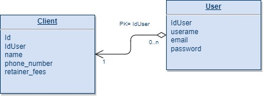

# Client Management System

This Application is developed with python's web framework DjangoRestFramework. \

### Project Requirements:
- Python 3.8.10
- SQLite

### Steps for setting up the project in local

1. Clone GitHub Repo: [https://github.com/Shreya412/client_management_django.git](https://github.com/Shreya412/client_management_django.git)
2. Create Virtual Env: ` python -m venv venv `
3. Activate venv: `source venv/bin/activate`(Linux) and `venv\Scripts\activate`(Windows)
4. Go Inside Project Folder: `cd client_management_django` and again `cd client_rest`
5. Download dependencies: `pip install -r requirements.txt`
6. Create `.env` file with following keys:
```bash
JWT_SECRET_KEY='asdfghjkl'
```
7. Run project: `python manage.py runserver` 
8. App will start on you local: [`http://127.0.0.1:8000/`](http://127.0.0.1:8000/)


### Database Design



### Access Level
 - **Admin access:**   can create, edit and delete users
 - **User access:** can create, update, view and delete their client

##
## End Points
### User Authentiation 

```
POST    /api/auth/login/
to login
Authentication: Public
Request Data:                                                
{
    Email: EmailStr
    password: str
}
Errors:
403 - User not found
403 - Incorrect Password
Response:                                       
{
    access_token: str
}
```

```
POST   /api/auth/register/ 
to create user
Request Data:
{
username: str
email: EmailStr
password: str
}
Errors: 
400 Email Already in Use
422 Invalid Request data
Response: 200 OK
```

### Clients

```
GET   /api/client/
To get the list of all clients of logged-in user
Authentication: User Level
Authorization: Bearer Token
Errors:
403 Not Authorized
403 Your token is invalid,login
403 Your token is expired,login
Response: 200 OK
[
    {
        "id": int
        "name": str
        "phone_number": str
        "retainer_fees": str
    }
]
```
```
GET   /api/client/{id}/
To get specific client with Id of logged-in user
Authentication: User Level
Errors:
400 Bad Request
403 Not Authorized
403 Your token is invalid,login
403 Your token is expired,login
404 Not Found
Response:
{
    "id": int
    "name": str
    "phone_number": str
    "retainer_fees": str
}
```
```
POST   /api/client/
To create client of logged-in user
Authentication: User Level
Authorization: Bearer Token
Request Data:
{
    "name": str
    "phone_number": str
    "retainer_fees": str
}
Errors:
403 Not Authorized
403 Your token is invalid,login
403 Your token is expired,login
422 Invalid request data
Response: 201 Created
{
    "id": int
    "name": str
    "phone_number": str
    "retainer_fees": str
}
```
PUT   /api/client/{id}
To update client of logged-in user
Authentication: User Level
Authorization: Bearer Token
Request Data:
{
    "name": str
    "phone_number": str
    "retainer_fees": str
}
Errors:
400 Bad Request
403 Not Authorized
403 Your token is invalid,login
403 Your token is expired,login
404 Not Found
422 Invalid request data
Response: 200 OK
{
    "id": int
    "name": str
    "phone_number": str
    "retainer_fees": str
}
```
DELETE   /api/client/{id}
To create client of logged-in user
Authentication: User Level
Authorization: Bearer Token
Errors:
400 Bad Request
403 Not Authorized
403 Your token is invalid,login
403 Your token is expired,login
404 Not Found
Response: 204 No Content
```

